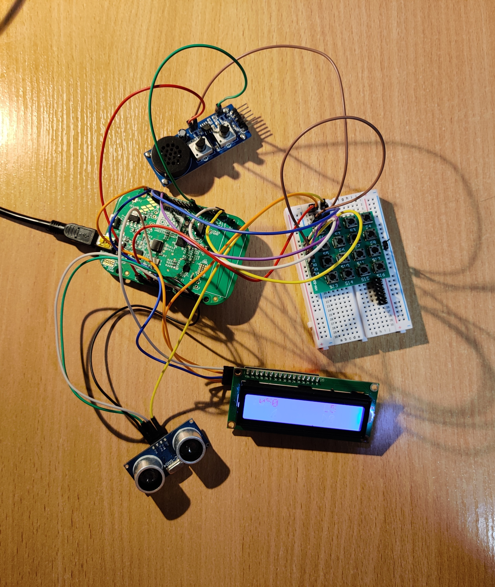

# The Theremin
FRDM-KL05Z microprocessor based music instrument.

Play different tones by changing the distance between HC-SR04 Ultrasonic distance sensor.

The project also has included recording capability where you can playback up to previously recorded 500 tones.

The video of the player in action can be accessed [Here](https://youtu.be/X8A2xFoFlBA).

## Authors
- Matej Horvat 
- Nace Pogačar

## License

